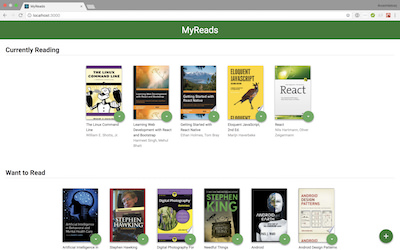
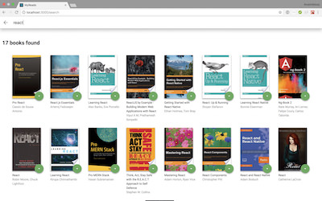

# MyReads

I created this website for the purposes of the [Udacity's Front-End Web Developer Nanodegree Program](https://www.udacity.com/course/front-end-web-developer-nanodegree--nd001) to showcase my skills in **React**.

## How to Load the Website

- Clone the **[repo](https://github.com/anastasioscho/udacity-myreads.git)**.
- Install [Node.js](https://nodejs.org/en/).
- In a terminal, cd into the project directory.
- Install all project dependencies with `npm install`.
- Start the development server with `npm start`.

## Important
The backend API uses a fixed set of cached search results and is limited to a particular set of search terms, which can be found in [SEARCH_TERMS.md](SEARCH_TERMS.md). That list of terms are the _only_ terms that will work with the backend, so don't be surprised if your searches for Basket Weaving or Bubble Wrap don't come back with any results.

## Create React App

This project was bootstrapped with [Create React App](https://github.com/facebookincubator/create-react-app). You can find more information on how to perform common tasks [here](https://github.com/facebookincubator/create-react-app/blob/master/packages/react-scripts/template/README.md).

## Screenshots

 
